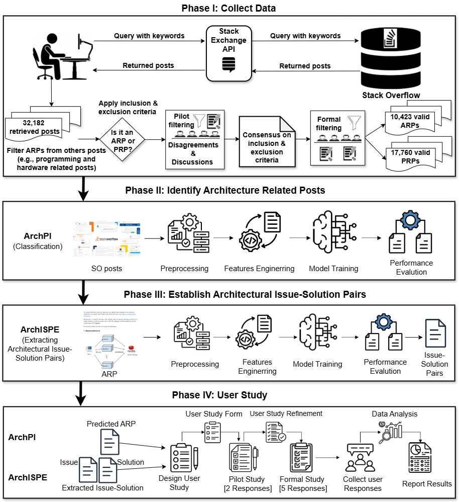
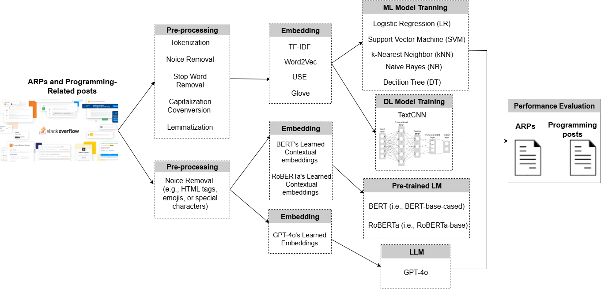
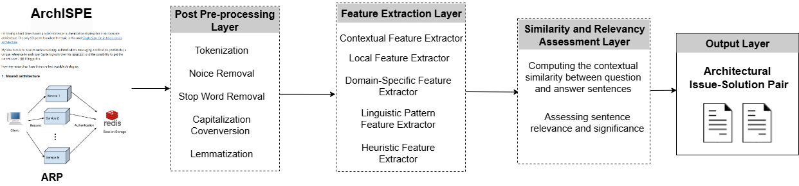

# Replication Package for the Paper: *ArchISMiner: Automatic Mining of Architectural Issue–Solution Pairs from Online Developer Communities*

This replication package for the paper ArchISMiner: Automatic Mining of Architectural Issue–Solution Pairs from Online Developer Communities.
This repository includes an introduction and research methodology overview, a description of the ArchISMiner framework, source code for its components and baselines, the dataset of Stack Overflow posts used in our study, and the experimental results.

## 🚨 Introduction and Research Methodology Overview

Stack Overflow (SO), a leading online community forum, is a rich source of software development knowledge. 
However, locating architectural knowledge (e.g., architectural solutions) remains challenging due to the overwhelming volume of unstructured content and fragmented discussions.
Developers must manually sift through posts to find relevant architectural insights, which is both time-consuming and error-prone. To address this, we introduce **ArchISMiner**, a framework for automatically mining architectural knowledge from SO. 
The research methodology employed is illustrated below:



## 🏗️ ArchISMiner Framework

**ArchISMiner** is a framework for automatically mining architectural knowledge from Stack Overflow (SO) posts. It comprises two complementary components:

- **ArchPI** – Identifies Architecture-Related Posts (ARPs) from the broader set of SO posts. Specifically, it leverages a diverse set of models, including traditional machine learning (ML), deep learning (DL), state-of-the-art pre-trained language models (PLMs), and large language models (LLMs), to select the optimal model for this task.

  

- **ArchISPE** – Extracts architectural issue–solution pairs from the identified ARPs to capture task-specific architectural knowledge. Given an ARP (i.e., a Question_body and its corresponding Answer_body) consisting of 𝑛 sentences, ArchISPE extracts a small set of key sentences that explicitly express architectural issues and solutions, and generates a concise, self-contained issue-solution pair for the post.

  

Together, these components enable software engineers, particularly architects and developers, to efficiently gather relevant and useful architectural knowledge from online developer communities.

## 📁 Repository Structure

```plaintext
├── data                  # Datasets used in the study
│ ├── New_data_source     # contains posts extracted from new data sources 

├── image/                # Contains figures that illustrate the overall research methodology and the architecture of the proposed framework, ArchISMiner.

├── models/               # Source code for the ArchISPE framework and baseline models

├── results/              # Experimental output and evaluation results

├── user_study/           # Contains materials from the user study, conducted across five sessions.

└── README.md             # Overview and usage instructions for this repository
```

## 🛠️ Dataset Description

The `data/` directory includes:
- `14932_ARPs_and_Programming_Posts.xlsx` – contains posts labeled as APRs and programming posts (i.e., 7,466 ARPs and 7,466 Programming Posts) used to train and test the classifiers. 
- `367_ARPs_for_extracting_Issue_Solution_Pairs.xlsx` – contains 367 randomly selected ARPs from the 7,466 ARPs, used to train our model and extract architectural issue–solution pairs.
- `ArchISPBench.xlsx` – contains our proposed architectural benchmark dataset used to evaluate the potential techniques for extracting architectural issue-solution pairs from online developer community forums. It contains 367 architectural issues and 1,964 solutions extracted from SO, with 5,234 sentence candidates (1,970 from questions and 3,264 from answers). This benchmark dataset provides a reusable resource for future studies, enabling consistent evaluation of new approaches or tools.
- 7,466 ARPs.xlsx 
The `results/` directory includes:

- xxx
- xxx
- xxx
- xxx
- xxx
  
The `data_from_new_sources/` directory includes:
- xxx
- xxx
- xxx
## Requirements

To install all dependencies, run:

```bash
pip install -r requirements.txt
```
> **Note:** For PyTorch, follow the official installation guide to ensure proper installation for your system (CPU or GPU support).


---
## 📝 Citation

```bibtex
@article{Musenga2025ArchISMiner,
  author = {Musengamana Jean de Dieu and Ruiyin Li and Peng Liang and Mojtaba Shahin and Muhammad Waseem and Zengyang Li and Bangchao Wang and Arif Ali Khan and Mst Shamima Aktar},
  title = {{ArchISMiner: Automatic Mining of Architectural Issue–Solution Pairs from Online Developer Communities}},
  journal={arXiv preprint arXiv:xxxx.xxxxx},
  year={2025}
}
```
